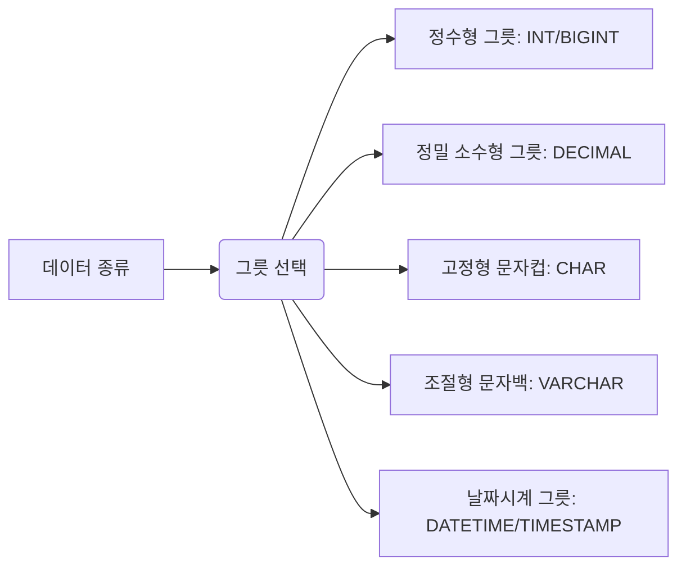
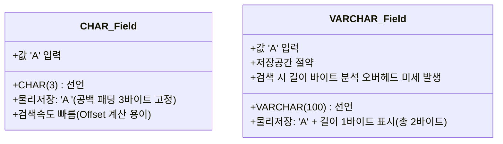

# MySQL 데이터 타입 및 DDL 기초 완벽 가이드

> [!NOTE]
> 이 가이드는 [ddl1.sql](file:///Users/morgan/Documents/workspace/260714_dml-ddl/ddl1.sql)의 데이터 타입 정의 및 테이블 생성을 바탕으로 작성되었습니다. 테이블 구조 정의(DDL) 및 다양한 데이터 타입의 저장 한계, 발생할 수 있는 데이터 주입 오류 원인을 정밀하게 학습하도록 구성했습니다.

---

## 1. DDL 및 CREATE TABLE 개요 (SQLD 핵심)

데이터 정의어(DDL)는 데이터베이스 스키마 객체(테이블, 뷰, 인덱스 등)를 생성, 수정, 삭제하는 명령어입니다. DDL은 실행 즉시 데이터베이스에 반영되는 **Auto-Commit** 성격을 띱니다.

### CREATE TABLE 기본 문법
```sql
CREATE TABLE [IF NOT EXISTS] table_name (
    column_1 data_type [DEFAULT default_value] [constraints],
    column_2 data_type,
    ...
);
```
* **`IF NOT EXISTS`**: 동일한 이름의 테이블이 이미 존재하더라도 에러를 발생시키지 않고 무시하도록 처리하여, 마이그레이션 스크립트 실행 시 **멱등성(Idempotency)**을 보장하는 유용한 옵션입니다.

---

## 2. 초심자를 위한 쉬운 비유

데이터베이스의 **데이터 타입**은 요리할 때 사용하는 **"보관용 그릇"**에 비유할 수 있습니다.



* **정수형 그릇 (`INT` / `BIGINT`)**: 
  * `INT`는 일반 종이컵 크기로 보통 수준의 숫자(최대 약 21억)만 담을 수 있습니다.
  * `BIGINT`는 대형 양동이 크기로 전 세계 인구수나 거대한 카운터 데이터(최대 약 900경)도 넘치지 않게 담을 수 있습니다.
* **정밀 소수형 그릇 (`DECIMAL`)**:
  * 소수점 연산 시 오차가 생기지 않도록 가로 칸막이를 정확히 쳐놓은 **"약약 조제용 계량 판"**입니다.
* **문자형 그릇 (`CHAR` vs `VARCHAR`)**:
  * `CHAR`는 형태가 고정된 **"플라스틱 컵"**입니다. 1글자를 넣든 3글자를 넣든 항상 3글자 크기의 공간을 점유합니다.
  * `VARCHAR`는 신축성 있는 **"비닐 팩"**입니다. 100글자용 비닐백에 10글자만 넣으면 10글자 크기로 쪼그라들어 용량을 아껴줍니다.
* **날짜형 그릇 (`DATETIME` vs `TIMESTAMP`)**:
  * `DATETIME`은 바늘이 고정되어 있는 일반 벽시계입니다. 내가 입력한 시각이 어느 국가에서 조회되든 동일하게 보입니다.
  * `TIMESTAMP`는 현재 위치를 파악해 자동으로 그 지역의 시각으로 바꿔 보여주는 **"스마트 워치"**입니다 (서버 타임존 연동).

---

## 3. SQL DDL 및 DML 일반화 예제

### (1) 데이터 타입별 테이블 정의 (DDL)
* 실무에서 자주 사용되는 필수 데이터 타입을 총망라한 구조 정의 예시입니다.
* 관련 예시 코드: [ddl1.sql:L3-L16](file:///Users/morgan/Documents/workspace/260714_dml-ddl/ddl1.sql#L3-L16)

```sql
CREATE TABLE IF NOT EXISTS test_schema_table (
    id INT AUTO_INCREMENT PRIMARY KEY,
    large_counter BIGINT DEFAULT 0,
    exact_price DECIMAL(12, 4), -- 전체 12자리, 소수점 이하 4자리 보장
    status_flag TINYINT DEFAULT 0, -- Boolean 대체용 (0 또는 1)
    fixed_code CHAR(5), -- 고정 크기 코드 영역
    variable_desc VARCHAR(2000), -- 가변 크기 설명문 영역
    large_text TEXT, -- 초대용량 텍스트 저장용
    birth_date DATE, -- YYYY-MM-DD 날짜 전용
    modified_at TIMESTAMP DEFAULT CURRENT_TIMESTAMP ON UPDATE CURRENT_TIMESTAMP -- 타임존 연동 날짜/시간
);
```

### (2) 값 한계치 오류 테스트 (DML)
* 데이터 타입이 보장하는 한계치나 형식을 준수하지 않을 경우 MySQL은 에러를 발생시킵니다.
* 관련 예시 코드: [ddl1.sql:L32-L46](file:///Users/morgan/Documents/workspace/260714_dml-ddl/ddl1.sql#L32-L46)

```sql
-- [1] DECIMAL 정밀도 초과 오류 테스트
-- exact_price DECIMAL(12, 4) 컬럼은 정수 부분이 최대 8자리(12-4)까지만 허용됩니다.
-- 아래와 같이 정수부가 9자리 이상이면 Out of range 에러가 발생합니다.
INSERT INTO test_schema_table (exact_price) 
VALUES (123456789.0123);

-- [2] CHAR 길이 초과 오류 테스트
-- CHAR(5) 컬럼에 6자 이상의 문자열을 주입하려 하면 Data too long 에러가 납니다.
INSERT INTO test_schema_table (fixed_code) 
VALUES ('KOREAN');
```

---

## 4. 주니어를 위한 원리 및 구조 설명 (Deep Dive)

### (1) CHAR와 VARCHAR의 물리적 저장 구조 차이
InnoDB 엔진에서 문자형 컬럼은 디스크 스페이스와 I/O 성능 면에서 다르게 처리됩니다.



* **`CHAR`**: 고정 길이 문자 타입으로, 선언 크기보다 짧은 문자열을 넣으면 남은 자리를 공백 패딩으로 채워 고정 크기로 저장합니다. 값이 조회될 때 공백은 자동 제거됩니다. 데이터의 길이가 모두 동일한 코드 값(예: 국가코드 KOR, USA) 저장 시 매우 빠른 무작위 읽기 성능을 보장합니다.
* **`VARCHAR`**: 가변 길이 타입으로, 실제 데이터 값의 바이트 외에 문자열의 실제 길이를 나타내는 추가 바이트(255자 이하는 1바이트, 초과는 2바이트)를 포함해 물리 디스크에 기록합니다. 따라서 가변 폭이 큰 설명 데이터 저장 시 저장 용량을 대폭 줄여줍니다.

### (2) DECIMAL의 고정 소수점 동작 원리 (부동 소수점과의 비교)
* 컴퓨터는 기본적으로 2진수를 쓰기 때문에 10진수 소수점을 정확히 표현하지 못하고 근사치로 계산합니다(`FLOAT`, `DOUBLE` 등의 부동소수점 오차 문제).
* **`DECIMAL(10, 2)`**은 숫자를 부동소수점으로 변환하지 않고, 정수부와 소수부를 분리하여 각 바이트 단위로 패킹하는 **고정 소수점** 방식을 채택합니다. 연산 오차가 결코 허용되지 않는 금융권 잔액이나 이자율 계산에 필수적으로 사용됩니다.

### (3) DATETIME과 TIMESTAMP의 핵심 구동 차이
* **`DATETIME` (8바이트)**: 클라이언트 세션의 타임존 설정과 무관하게 입력된 문자 시각 그대로(`YYYY-MM-DD HH:MM:SS`) 저장 및 출력됩니다. 타임존의 영향을 받지 않는 절대적 일시 보관에 유용합니다 (허용 범위: `1000-01-01` ~ `9999-12-31`).
* **`TIMESTAMP` (4바이트)**: 입력된 현지 시각을 데이터베이스 내부적으로 **UTC(협정 세계시)**로 변환하여 4바이트 정수로 기록합니다. 조회할 때는 조회 세션의 타임존 설정에 맞춰 다시 변환되어 표시됩니다. 다국어 글로벌 서비스 구현에 적합하지만, 표현 범위가 `1970-01-01` ~ `2038-01-19`로 제한되는 한계가 있습니다.

---

## 5. SQLD 자격증 준비 대비 요약 가이드

### ① 정밀 데이터 타입의 자리수 산정 기법
* SQLD 검정에서 `DECIMAL(P, S)`의 범위를 계산하는 문제 해결법:
  * `P`(Precision): 전체 숫자의 유효 자릿수 (정수부 + 소수부 합산).
  * `S`(Scale): 소수점 이하 자릿수.
  * 정수부의 최대 허용 자릿수는 **`P - S`**가 됩니다. 예컨대 `DECIMAL(5, 2)`는 전체 5자리 중 소수점 아래가 2자리이므로 정수부는 `999`까지가 한계입니다.

### ② DDL의 특징과 롤백
* `CREATE`, `ALTER`, `DROP` 등 DDL 명령은 실행 시 데이터베이스 사전에 직접 정의 정보를 쓰고 내부 시스템 테이블을 변경하기 때문에 즉시 트랜잭션이 종결되며 Auto-Commit됩니다.
* 따라서 `START TRANSACTION` 선언 후 DDL 작업을 하고 `ROLLBACK`을 호출하더라도 **DDL은 롤백되지 않고 데이터베이스에 그대로 남아있음**을 확실히 인지해야 합니다.

---

## 6. 기술 면접 예상 질문 & 모범 답안

### Q1. `CHAR`와 `VARCHAR` 중 주소 데이터를 저장할 때 어느 타입이 더 유리한지 아키텍처 관점에서 설명해주세요.
> **모범 답안:**
> 주소 데이터는 지역마다 글자 수 편차가 매우 큰 가변 데이터입니다. 따라서 저장 장치 공간의 효율성 극대화를 위해 가변 길이 타입인 **`VARCHAR`**가 훨씬 유리합니다.
> 만약 `CHAR`를 사용하게 되면 최대 주소 길이에 맞추어 크게 자리를 잡아야 하므로 데이터가 짧은 대다수 행에서 불필요한 공백 패딩이 저장되어 디스크 용량이 낭비되고, 버퍼 풀 메모리 효율이 저하되어 더 많은 물리 디스크 I/O를 유발하게 됩니다. 반면 데이터가 거의 일정한 UUID나 국가코드(3글자 고정 등)는 길이를 판단하는 메타 정보 바이트 소모가 없는 `CHAR`를 쓰는 것이 성능상 최적입니다.

### Q2. 글로벌 사용자가 분포된 서비스에서 주문 시각을 기록하려 할 때, `DATETIME`과 `TIMESTAMP` 중 어떤 것을 선택해야 하는지 그 근거를 제시해주세요.
> **모범 답안:**
> 주문 시각 기록에는 **`TIMESTAMP`**가 적합합니다. 
> `TIMESTAMP`는 데이터베이스 서버 세션 타임존에 따라 입력 시 UTC로 변환 저장되고, 미국이나 한국 등 사용자의 클라이언트 위치(Timezone)에 맞춰 현지 시간으로 자동 변환해 보여줍니다. 반면 `DATETIME`은 타임존 변환 기능 없이 항상 고정된 텍스트 문자 시각만 반환하므로 다국가 유저가 동시에 사용하는 환경에서는 시각 왜곡이 생깁니다. 다만 2038년 이후의 데이터 보존이나 시스템 이전이 필요하다면 애플리케이션 레벨에서 UTC로 변환하여 `DATETIME`에 밀어 넣는 대안도 함께 검토할 수 있습니다.

### Q3. `DECIMAL(10, 2)` 컬럼에 `123456789.01`을 INSERT 하려 하면 데이터베이스 내부에서 어떤 에러가 발생하며 그 원인은 무엇인가요?
> **모범 답안:**
> * **결과**: `Out of range value for column` 에러가 발생하며 삽입에 실패합니다.
> * **원인**: `DECIMAL(10, 2)`는 전체 최대 자릿수가 10자리이며, 그중 소수점 이하 자리가 2자리로 설정되어 있습니다. 따라서 정수부는 최대 8자리(`10 - 2`)까지만 담을 수 있습니다. 그러나 입력하려는 `123456789`는 정수부가 9자리이므로 저장 가능한 한계 크기를 벗어났기 때문에 거부 처리되는 것입니다.
