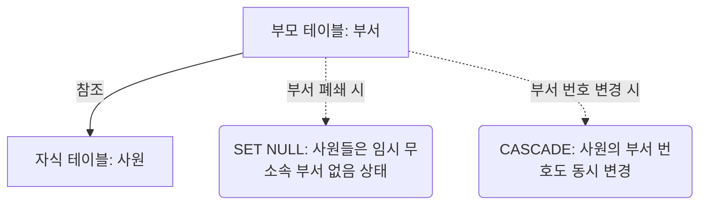

# MySQL 제약 조건 및 참조 무결성 완벽 가이드

> [!NOTE]
> 이 가이드는 [ddl2.sql](file:///Users/morgan/Documents/workspace/260714_dml-ddl/ddl2.sql)의 부모-자식 외래키 관계 정의 및 제약 조건 설정들을 바탕으로 작성되었습니다. 주요 제약 조건(PK, FK, Unique, Not Null 등)의 실무적 적용 방안과 위배 시 발생하는 오류 분석에 초점을 두었습니다.

---

## 1. 제약 조건(Constraints) 및 참조 무결성 개요 (SQLD 핵심)

데이터베이스 제약 조건은 데이터의 **무결성(Integrity)**을 기계적 수준에서 보장하기 위한 강제 규칙입니다. 테이블 정의 시 부여하여 비정상 데이터의 유입을 물리적으로 차단합니다.

### 5대 주요 제약 조건 종류

| 제약 조건 | 설명 | NULL 허용 | 테이블당 개수 |
| :--- | :--- | :--- | :--- |
| **PRIMARY KEY** (기본키) | 행을 대표하는 유일한 식별자 (Unique + Not Null) | **불가** | **단 1개만** 설정 가능 |
| **FOREIGN KEY** (외래키) | 타 테이블의 PK/UK를 참조하여 데이터 간 종속성 매핑 | **허용** | 제약 없이 다수 설정 가능 |
| **UNIQUE** (고유키) | 중복을 허용하지 않고 유일한 값 보장 | **허용** (여러 NULL 가능) | 여러 개 지정 가능 |
| **NOT NULL** (필수값) | 값이 비어있는 것(NULL)을 허용치 않고 반드시 값 요구 | **불가** | 제한 없음 |
| **DEFAULT** (기본값) | 데이터 주입 시 값을 명시하지 않았을 때 들어갈 초기 기본값 | N/A | 제한 없음 |

### 참조 무결성 옵션 (FK Referential Actions)
부모 테이블 데이터의 수정 또는 삭제가 일어날 때, 자식 테이블의 외래키 매핑 관계를 제어하는 정책입니다.
* **`ON DELETE SET NULL`**: 부모 테이블의 행이 삭제되면, 해당 행을 참조하고 있던 자식 테이블의 FK 값을 `NULL`로 변경합니다. (자식 데이터 보존 필요시 사용)
* **`ON UPDATE CASCADE`**: 부모 테이블의 PK 값이 변경되면, 자식 테이블의 참조하고 있는 FK 값도 연동되어 동일한 값으로 동시 수정됩니다.
* **`ON DELETE RESTRICT` (기본값)**: 자식 테이블이 참조하고 있으면 부모 테이블의 데이터 삭제를 원천 봉쇄(차단)합니다.

---

## 2. 초심자를 위한 쉬운 비유

### (1) 제약 조건의 규칙 비유
* **Primary Key (기본키)**: 학생들의 고유한 **"학번"**입니다. 학번이 없는 학생(NULL)은 입학할 수 없고, 동명이인이 있더라도 학번은 겹칠 수 없습니다.
* **Unique (고유키)**: 학생들의 **"개인 휴대폰 번호"**입니다. 휴대폰이 아직 없는 학생(NULL)이 여러 명 있을 수는 있으나, 휴대폰 번호가 있는 학생들끼리는 번호가 서로 겹치면 안 됩니다.
* **Not Null (필수값)**: 입학원서의 **"이름 칸"**입니다. 공백으로 비워두고 제출하면 입학 접수기에서 거부되어 에러가 납니다.

### (2) 외래키 및 참조 행동(Referential Action) 비유

* **외래키(Foreign Key)**: 회사 사원이 가지고 있는 **"부서 카드 출입증"**입니다. 이 카드는 실제로 존재하는 부서( departments )에 등록된 번호여야만 발급이 됩니다 (참조 무결성). 
* **ON DELETE SET NULL**: 개발팀 부서가 사라졌습니다. 그렇다고 개발팀에 소속된 사원을 해고(삭제)하지 않고, 사원 카드의 소속란만 잠시 **"부서 없음(NULL)"**으로 처리해 대기 상태로 두는 자비로운 규칙입니다.
* **ON UPDATE CASCADE**: 인사부서 번호가 10번에서 88번으로 변경되었습니다. 사원들이 일일이 수정 신청하지 않아도, 시스템이 알아서 인사부 사원들의 출입증 소속 번호를 88번으로 자동 동기화 해줍니다.

---

## 3. SQL DDL 및 DML 일반화 예제

### (1) 외래키 제약조건을 동반한 테이블 생성 (DDL)
* 부모 테이블과 자식 테이블 간의 안전한 종속성을 설정하는 모범 템플릿입니다.
* 관련 예시 코드: [ddl2.sql:L1-L19](file:///Users/morgan/Documents/workspace/260714_dml-ddl/ddl2.sql#L1-L19)

```sql
-- [1] 부모 테이블 생성
CREATE TABLE parent_table (
    parent_id INT PRIMARY KEY,
    parent_name VARCHAR(50) NOT NULL UNIQUE
);

-- [2] 자식 테이블 생성 (FK 매핑)
CREATE TABLE child_table (
    child_id INT AUTO_INCREMENT PRIMARY KEY,
    child_email VARCHAR(100) NOT NULL UNIQUE,
    parent_id INT, -- 외래키로 지정할 컬럼
    
    -- 외래키 제약조건 추가
    FOREIGN KEY (parent_id) REFERENCES parent_table(parent_id)
        ON DELETE SET NULL
        ON UPDATE CASCADE
);
```

### (2) 제약조건 오류 상황 재현 (DML)
* 제약 조건을 어겨 쿼리가 실패하는 상황의 케이스 분석입니다.
* 관련 예시 코드: [ddl2.sql:L30-L39](file:///Users/morgan/Documents/workspace/260714_dml-ddl/ddl2.sql#L30-L39)

```sql
-- [케이스 A] PK 중복 및 NULL 삽입 실패
-- 이미 ID 10이 존재하는 상태에서 또 10을 입력하거나 NULL을 삽입할 때 발생 (Error 1062 / 1048)
INSERT INTO parent_table (parent_id, parent_name) VALUES (10, '이름A');
INSERT INTO parent_table (parent_id, parent_name) VALUES (10, '이름B'); -- 중복 에러
INSERT INTO parent_table (parent_id, parent_name) VALUES (NULL, '이름C'); -- NULL 에러

-- [케이스 B] 참조 무결성(외래키) 위배
-- parent_table에 존재하지 않는 ID 99를 자식 데이터에 부여하려 할 때 발생 (Error 1452)
INSERT INTO child_table (child_email, parent_id) VALUES ('test@email.com', 99); -- 존재하지 않는 부모 참조 불가 에러
```

---

## 4. 주니어를 위한 원리 및 구조 설명 (Deep Dive)

### (1) 외래키가 걸린 컬럼에 인덱스(Index)가 필요한 이유
* MySQL(InnoDB)은 외래키를 지정하면 해당 참조 컬럼에 **인덱스를 자동으로 생성**합니다 (이미 개발자가 선언한 인덱스가 없다면).
* 부모 행이 수정되거나 삭제될 때, 자식 테이블에 해당 행을 참조하는 레코드가 있는지 검색하기 위해 풀 테이블 스캔(Full Table Scan)을 돌면 심각한 성능 저하가 일어납니다. 따라서 락 탐색 속도를 단축하고 정합성을 빠르게 점검하기 위해 반드시 외래키 컬럼에는 인덱스가 필수적입니다.

### (2) ON DELETE SET NULL / CASCADE 의 내부 잠금(Locking) 전파와 데드락
* **잠금 전파**: 부모 테이블에서 `DELETE FROM parent_table WHERE parent_id = 10;`을 실행하면, 자식 테이블의 관련 레코드들을 찾아 `parent_id = NULL`로 변경해야 합니다.
* 이때 InnoDB는 부모 테이블의 행뿐만 아니라 자식 테이블의 갱신 대상 행들에까지 **배타적 락(Exclusive Lock, X-Lock)**을 걸게 됩니다.
* 이로 인해 다수의 동시 쓰기가 발생하는 환경에서 부모-자식 간 상호 교차 잠금 획득 대기가 생기면 **데드락(Deadlock)** 상태에 빠지기 쉬워지므로 설계 시 데이터 전파 범위를 면밀히 예측해야 합니다.

---

## 5. SQLD 자격증 준비 대비 요약 가이드

### ① PK와 UNIQUE의 NULL 처리 차이
* **`PRIMARY KEY`**는 엔티티 내 개별 인스턴스의 절대적 고유성을 뜻하는 개체 무결성을 나타내므로 **절대 NULL 값을 가질 수 없습니다.**
* **`UNIQUE KEY`**는 고유 식별 목적이지만 필수 입력을 제한하지는 않는 선택적 제약 조건이므로 **NULL 값을 가질 수 있습니다.** 심지어, SQL 표준에 따라 한 고유 컬럼 내에 **여러 개의 NULL 값이 존재하는 것이 허용**됩니다 (NULL은 비교 대상이 아니기 때문).

### ② 개체 무결성 vs 참조 무결성
* **개체 무결성(Entity Integrity)**: 모든 테이블은 PK를 가져야 하며, PK는 NULL이나 중복값을 가질 수 없다는 원칙.
* **참조 무결성(Referential Integrity)**: 자식 테이블의 FK 값은 부모 테이블의 PK에 항상 존재하거나, 혹은 완전한 NULL이어야 한다는 원칙.

---

## 6. 기술 면접 예상 질문 & 모범 답안

### Q1. 실무에서 대량 트래픽 서비스나 대형 서비스 아키텍처 설계 시 외래키(Foreign Key) 제약 조건을 DB 레벨에 설정하지 않는 이유와 대안을 설명해주세요.
> **모범 답안:**
> 1. **성능 저하 및 락 병목**: 외래키가 존재하면 모든 쓰기 작업(Insert, Update, Delete) 시 정합성 검증을 위해 참조 대상 테이블에 읽기 락을 거는 등 성능 오버헤드가 크며, 관계 삭제 시 연쇄 잠금(Lock Propagation)으로 인한 쓰기 병목이 유발됩니다.
> 2. **DB 분할의 어려움**: 서비스 확장으로 테이블을 다른 서버(샤딩, 데이터베이스 분할)로 쪼갤 때 물리적 외래키 제약조건이 있으면 샤드 간 조인 및 참조 검증이 물리적으로 불가능해집니다.
> * **대안**: 물리 외래키를 생략하고 인덱스 컬럼으로만 맺은 뒤, 데이터 정합성 검증은 **애플리케이션 비즈니스 로직 레벨**에서 철저히 수행하며 주기적 배치 작업을 통해 싱크 에러를 보정하고 리포팅하도록 아키텍처를 설계합니다.

### Q2. `UNIQUE` 제약조건이 걸려있는 컬럼에 `NULL` 값을 여러 번 삽입하려 할 때, 중복 오류가 발생하는지 여부와 그 내부적인 처리에 대해 말해보세요.
> **모범 답안:**
> **중복 오류가 발생하지 않고 여러 개의 NULL이 정상 삽입됩니다.**
> 데이터베이스 표준 정의상 `NULL`은 '존재하지 않는 미지의 값'을 뜻합니다. 따라서 `NULL`끼리는 "서로 같은 값인지(동등 비교)"를 비교해 판단할 수 없는 속성을 가집니다. 이에 따라 DBMS는 UNIQUE 제약 조건 검증 단계에서 NULL은 중복 체크 대상으로 보지 않고 무사통과시키므로 다수의 NULL 저장이 가능하게 구현되어 있습니다.

### Q3. `ON DELETE SET NULL` 옵션이 적용되어 있을 때, 부모 행을 지웠을 때의 연쇄 동작과 이 옵션이 정상 실행되기 위해 자식 테이블의 해당 외래키 컬럼이 가지고 있어야 하는 조건이 무엇인지 설명해 주세요.
> **모범 답안:**
> * **동작**: 부모 테이블의 특정 레코드가 지워질 때 자식 테이블에서 해당 레코드를 참조하고 있던 참조키(FK) 값들이 즉시 `NULL`로 강제 업데이트(Update)됩니다.
> * **필수 조건**: 이 연동 작업이 에러 없이 실행되려면 자식 테이블의 외래키 컬럼이 **`NOT NULL` 제약 조건이 걸려있지 않아야(Nullable)** 합니다. 만약 외래키 컬럼이 NOT NULL이면서 ON DELETE SET NULL이 걸려있다면, 삭제 연쇄 작용으로 NULL 입력을 시도할 때 제약 조건 충돌 에러가 발생해 부모 레코드 삭제 조차 실패하게 됩니다.
