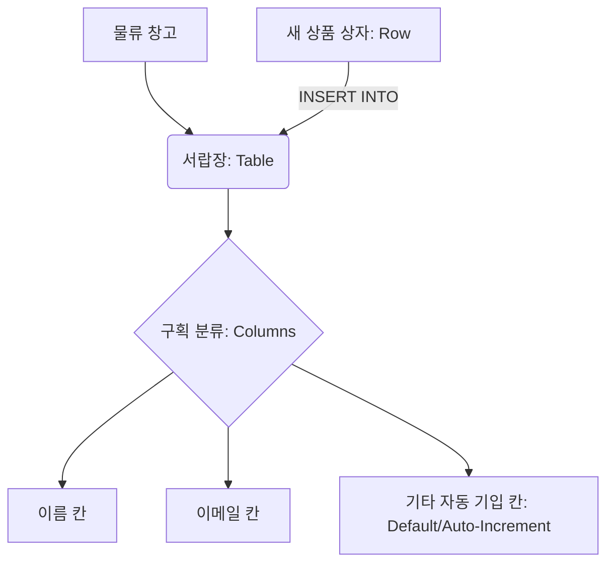
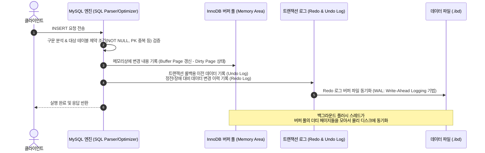

# MySQL DML (Data Manipulation Language) 완벽 가이드

> [!NOTE]
> 이 가이드는 [dml01.sql](file:///Users/morgan/Documents/workspace/260714_dml-ddl/dml01.sql)의 DML 흐름을 바탕으로 작성되었습니다. 테이블 구조 정의(DDL) 과정을 생략하고, 오직 데이터 삽입 및 조작(DML)에 초점을 맞춰 작성된 MySQL 기준의 종합 학습서입니다.

---

## 1. DML 개요 (SQLD 시험 핵심)

데이터베이스 조작어(DML)는 이미 정의된 데이터베이스 스키마 내의 **데이터(행/Row)**를 삽입, 수정, 삭제, 조회하는 명령어입니다. SQLD 자격증 준비 및 실무 면접을 위해 DML과 다른 SQL 카테고리의 차이점을 명확히 알아야 합니다.

### SQL 명령어 유형 비교

| 구분 | 명령어 | 대상 | 트랜잭션 제어 (ROLLBACK) | 설명 |
| :--- | :--- | :--- | :--- | :--- |
| **DML** (Data Manipulation Language) | `INSERT`, `UPDATE`, `DELETE`, `SELECT` | 테이블 내의 **데이터 (행 단위)** | **가능** (Undo 로그 기록) | 데이터를 추가, 수정, 삭제, 조회 |
| **DDL** (Data Definition Language) | `CREATE`, `ALTER`, `DROP`, `TRUNCATE` | 데이터베이스 **객체 (테이블, 인덱스 등)** | **불가능** (Auto-Commit 실행) | 테이블의 구조나 설정을 정의/변경 |
| **DCL** (Data Control Language) | `GRANT`, `REVOKE` | 사용자 및 권한 | 일반적으로 즉시 반영 | 데이터 접근 및 권한 관리 |
| **TCL** (Transaction Control Language) | `COMMIT`, `ROLLBACK`, `SAVEPOINT` | 트랜잭션 논리 단위 | N/A | DML 실행 내용을 확정하거나 취소 |

> [!IMPORTANT]
> **SQLD 빈출 포인트 (TRUNCATE vs DELETE):**
> - `DELETE`는 DML에 속하며, 조건절(`WHERE`)을 사용하여 원하는 행만 지울 수 있고 롤백이 가능합니다.
> - `TRUNCATE`는 DDL에 속하며, 테이블의 모든 데이터를 삭제하고 저장 공간을 초기화시키지만 롤백이 불가능합니다.

---

## 2. 초심자를 위한 쉬운 비유

데이터베이스 테이블을 **"백화점의 물류 보관용 서랍장"**으로 생각하면 이해하기 쉽습니다.



* **테이블 (Table)** = **수납 서랍장**
* **열 (Column)** = 수납칸 마다 미리 정해진 **라벨(이름, 이메일, 가입일 등)**
* **행 (Row / Record)** = 수납칸 규격에 맞춰 차곡차곡 쌓는 **"개별 상품 상자"**
* **INSERT** = **"새 상품 상자를 지정된 구획 라벨에 맞게 서랍장에 밀어 넣는 행위"**
  * 이때, '보관일시'나 '자동 번호표'가 붙어 있는 칸은 우리가 직접 입력하지 않아도 서랍장 시스템이 자동으로 채워줍니다 (`AUTO_INCREMENT` / `DEFAULT`).
* **INSERT SELECT (대량 이관)** = **"임시 보관함에 들어있는 여러 상품들 중에서 특정 스티커가 붙은 물건들만 골라내어 보관용 서랍장에 한 번에 밀어 넣는 컨베이어 벨트 작업"**

---

## 3. SQL DML 문법 및 일반화 예제

실제 수집된 파일의 DML 패턴을 추상화하여 보편적인 SQL 작성법으로 설명합니다.

### (1) 단일 행 삽입 (Single Row INSERT)
*특정 컬럼을 지정하여 하나의 레코드를 삽입합니다. 기본값(Default)이나 자동 증가값(Auto-Increment)을 갖는 컬럼은 명시하지 않아도 자동으로 채워집니다.*
* 관련 예시 코드: [dml01.sql:L25-L28](file:///Users/morgan/Documents/workspace/260714_dml-ddl/dml01.sql#L25-L28)

```sql
INSERT INTO target_table 
    (column_a, column_b) 
VALUES 
    (value_a1, value_b1);
```

### (2) 다중 행 삽입 (Multi-Row / Bulk INSERT)
*한 번의 쿼리로 다수의 레코드를 삽입하여, 데이터베이스와의 통신 비용(Network Round-Trip)을 획기적으로 줄여줍니다.*
* 관련 예시 코드: [dml01.sql:L32-L38](file:///Users/morgan/Documents/workspace/260714_dml-ddl/dml01.sql#L32-L38)

```sql
INSERT INTO target_table 
    (column_a, column_b) 
VALUES 
    (value_a1, value_b1),
    (value_a2, value_b2),
    (value_a3, value_b3);
```

### (3) 서브쿼리를 통한 대량 복사 및 삽입 (INSERT INTO SELECT)
*다른 테이블에서 조건에 맞게 조회한 데이터를 구조가 호환되는 대상 테이블로 한 번에 복사합니다. `VALUES` 절이 포함되지 않는 점에 유의해야 합니다.*
* 관련 예시 코드: [dml01.sql:L42-L49](file:///Users/morgan/Documents/workspace/260714_dml-ddl/dml01.sql#L42-L49)

```sql
INSERT INTO destination_table 
    (dest_col_id, dest_col_name, dest_col_email)
SELECT 
    source_col_id, 
    source_col_name, 
    source_col_email
FROM 
    source_table
WHERE 
    source_col_name LIKE '%search_keyword%';
```

> [!WARNING]
> **INSERT SELECT 실행 시 제약 사항 (SQLD 필수)**
> 1. **컬럼 개수와 순서의 일치**: Target 테이블에 나열된 컬럼(`dest_col_id`, `dest_col_name` ...)의 개수 및 자료형 순서가 `SELECT`하는 결과셋의 컬럼 정보와 일치해야 합니다.
> 2. **제약조건 검증**: 원본 테이블 데이터 중 대상 테이블의 PK, Unique, NOT NULL 제약 조건을 위반하는 값이 섞여 있다면 쿼리 전체가 에러를 발생시키며 롤백됩니다.

---

## 4. 주니어를 위한 원리 및 구조 설명 (Deep Dive)

### (1) INSERT 실행 시 물리적 동작 메커니즘
MySQL의 디폴트 스토리지 엔진인 **InnoDB**에서 INSERT 쿼리가 수행될 때, 내부 성능과 정합성을 지키기 위해 다음과 같은 절차로 물리 디스크와 메모리를 제어합니다.



* **WAL (Write-Ahead Logging)**: 실제 데이터 파일(`.ibd`)에 즉시 기록하는 것은 디스크 I/O 비용이 매우 높습니다. 대신, 메모리(Buffer Pool)에 먼저 기록하고 순차 기록 방식인 Redo 로그 파일에 변경 내역을 먼저 남겨 영속성을 보장받습니다.

### (2) 인덱스(B-Tree)와 제약조건 검증의 영향도
* **Unique/Primary Key 중복 검사**: 중복을 검사하기 위해 인덱스 리프 노드를 탐색해야 합니다. 이때 MySQL은 공유 락(Shared Lock) 혹은 배타적 락(Exclusive Lock)을 적용하여 동시성 제어가 들어가며, 인덱스가 많을수록 이 탐색과 정렬 오버헤드가 급증합니다.
* **AUTO_INCREMENT 잠금**: 여러 커넥션에서 동시에 INSERT를 시도할 때 식별 번호가 겹치지 않게 하기 위해 테이블 수준에서 아주 짧게 동작하는 뮤텍스나 락(`AUTO-INC lock`)을 획득합니다.

### (3) 암묵적 NULL vs 명시적 NULL
SQLD 시험 및 실무 설계 시 주의해야 할 사항으로, 컬럼을 입력하지 않는 행위와 직접 `NULL`을 입력하는 행위는 작동 메커니즘이 다릅니다.

* **암묵적 NULL (Omission)**: `INSERT INTO table (col_a) VALUES (val_a)` 처럼 `col_b`를 생략할 때 발생합니다. `col_b`에 선언된 `DEFAULT` 제약 조건 값이 자동으로 할당됩니다.
* **명시적 NULL (Explicit)**: `INSERT INTO table (col_a, col_b) VALUES (val_a, NULL)`과 같이 작성할 경우, `col_b`에 설정된 `DEFAULT` 값을 무시하고 **강제로 `NULL`을 입력**합니다. 이때 해당 컬럼이 `NOT NULL` 제약 조건이라면 에러가 발생합니다.

---

## 5. SQLD 자격증 준비 대비 요약 가이드

### ① DML과 트랜잭션(Transaction)
* Oracle은 DML 수행 후 사용자가 직접 `COMMIT` 또는 `ROLLBACK`을 해야 디스크에 최종 반영되지만, **MySQL은 기본 설정으로 Auto-Commit이 활성화**되어 있습니다.
* 자격검정 시험 문제에서 "SQL을 실행한 후 결과 상태를 고르시오"와 같은 유형을 풀 때는 환경 설정을 꼭 확인해야 합니다.

### ② 서브쿼리를 사용한 INSERT SELECT 시 락(Lock)
* MySQL(격리수준 REPEATABLE READ 기준)에서 `INSERT INTO target SELECT * FROM source`를 실행하면, `source` 테이블의 조회되는 행들에 **공유 락(Shared Lock, S-Lock)**이 걸립니다.
* 따라서 복사하는 도중 다른 세션에서 `source` 테이블 데이터를 `UPDATE`하거나 `DELETE`하려고 하면 블로킹(대기)이 발생하므로 대용량 서비스에서는 주의해야 합니다.

---

## 6. 기술 면접 예상 질문 & 모범 답안

### Q1. 대용량 데이터를 테이블에 빠르게 적재(Bulk Insert)할 때 고려할 성능 최적화 방법을 3가지 이상 설명해주세요.
> **모범 답안:**
> 1. **Bulk Insert 쿼리 적용**: 단일 INSERT 쿼리를 루프 돌려 실행하면 파싱, 세션 통신, 디스크 동기화 비용이 개별로 청구됩니다. 이를 다중 행 삽입 쿼리(`INSERT INTO table VALUES (...), (...);`) 형태로 묶으면 파싱 비용과 로그 I/O를 크게 개선할 수 있습니다.
> 2. **트랜잭션 단위 묶음 처리**: Auto-Commit 모드를 끄고(`START TRANSACTION;`), 일정 건수(예: 1,000건~10,000건 단위)마다 커밋(`COMMIT;`)을 수행하여 물리 디스크 저장 장치로의 로그 플러싱 횟수를 줄입니다.
> 3. **인덱스 임시 해제**: 삽입 작업 시 매번 인덱스 리프 노드의 재배치(Page Split) 및 정렬이 발생하므로, 대용량 이관 시에는 임시로 인덱스를 삭제(또는 비활성화)하고 데이터를 전부 입력한 후 인덱스를 다시 빌드하는 것이 총 실행 시간을 단축시킵니다.

### Q2. Unique 제약 조건이 걸려있는 컬럼에 데이터를 넣을 때 중복 에러가 나는 것을 방지하는 MySQL의 구문 2가지와 그 차이를 말해보세요.
> **모범 답안:**
> MySQL에서는 `INSERT IGNORE`와 `ON DUPLICATE KEY UPDATE` 문법을 제공합니다.
> * **`INSERT IGNORE`**: 중복 키 충돌이 발생하면 삽입하려는 데이터 입력을 그냥 무시(Ignore)하고 경고(Warning)만 남긴 채 다음 로직을 계속 이어갑니다.
> * **`ON DUPLICATE KEY UPDATE`**: 중복 충돌이 났을 때 무시하는 대신, 기존에 있던 데이터를 지정된 값으로 수정(`UPDATE`)하도록 분기 처리합니다. 이는 서비스 단에서 Upsert(Insert + Update)를 단일 쿼리로 안전하게 수행할 때 씁니다.

### Q3. `AUTO_INCREMENT` 컬럼이 적용된 테이블에 데이터를 INSERT 하다가 특정 에러(예: 이메일 중복 제약조건 에러)로 인해 쿼리가 실패했습니다. 이후 다시 정상 데이터를 넣으면 다음 키 번호는 연속될까요?
> **모범 답안:**
> **연속되지 않고 공백(Gap)이 생깁니다.**
> MySQL(InnoDB)은 동시성 성능 향상을 위해 여러 커넥션에서 자동 번호를 요청할 때 경량 잠금인 `AUTO-INC lock`을 사용하여 즉시 번호만 올려 반환합니다. 만약 이후 실제 삽입 과정에서 다른 컬럼에 의한 제약 조건 위반으로 트랜잭션이 실패/롤백되어도, 한 번 발급된 `AUTO_INCREMENT` 값은 뒤로 롤백되지 않고 소모 처리되므로 시퀀스 번호 상에 빈틈(Gap)이 발생하게 됩니다.
