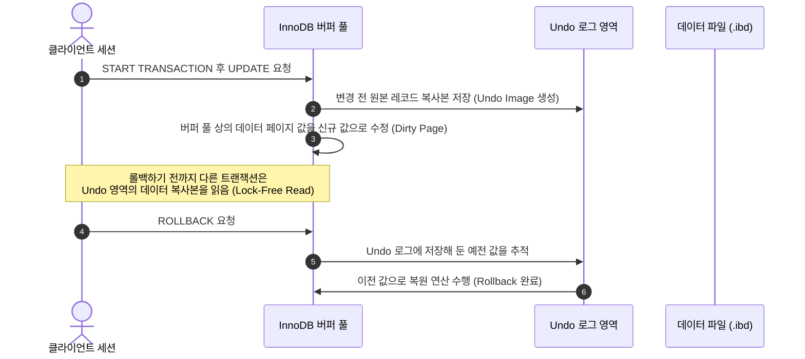

# MySQL UPDATE & 트랜잭션 제어 완벽 가이드

> [!NOTE]
> 이 가이드는 [dml02.sql](file:///Users/morgan/Documents/workspace/260714_dml-ddl/dml02.sql)의 UPDATE 및 트랜잭션 흐름을 바탕으로 작성되었습니다. 데이터 수정(UPDATE), 트랜잭션 제어(TCL), MySQL 특화 에러(Error 1175, Error 1093)의 원인과 우회 기법을 상세히 분석합니다.

---

## 1. DML: UPDATE 개요 및 SQL_SAFE_UPDATES (SQLD 핵심)

데이터 수정(UPDATE)은 테이블 내에 존재하는 기존 행의 값을 변경하는 DML입니다. 실수로 조건절을 빠뜨려 테이블 전체 데이터가 변경되는 것을 방지하기 위해 MySQL은 안전 메커니즘을 제공합니다.

### UPDATE 기본 구조
```sql
UPDATE target_table
SET column_name = new_value
WHERE condition_column = condition_value;
```

### SQL_SAFE_UPDATES 세팅
* **개념**: MySQL에서 실수로 전체 행을 갱신하거나 삭제하는 대형 장애를 막기 위한 옵션입니다.
* **동작**: `SET SQL_SAFE_UPDATES = 1;`이 활성화되면 `WHERE` 절에 키 컬럼(Primary Key 또는 Index Key)을 조건으로 주지 않거나, `LIMIT` 절을 동반하지 않는 모든 `UPDATE` / `DELETE` 구문은 에러를 내며 거부됩니다.
* 관련 예시 코드: [dml02.sql:L7-L13](file:///Users/morgan/Documents/workspace/260714_dml-ddl/dml02.sql#L7-L13)

---

## 2. 초심자를 위한 쉬운 비유

### (1) UPDATE와 WHERE 절: 전체 상표 바코드 오염
* **상황**: 물류 창고에 쌓여있는 10만 개의 장난감 중 **"불량 피카츄"** 1개의 이름표만 "반품 상품"으로 수정하려고 합니다.
* **WHERE 절이 없는 UPDATE**: 창고 직원에게 "장난감 박스 이름을 전부 반품 상품으로 고쳐라!" 하고 조건 없이 지시한 격입니다. 정상 제품인 몬스터볼, 파이리 등 99,999개의 박스 이름까지 전부 한순간에 지워져 물류창고 전체가 마비됩니다.
* **SQL_SAFE_UPDATES (안전 장치)**: 창고 정문에 있는 경비원입니다. 경비원은 "박스의 고유 일련번호(PK)가 지정되지 않은 대량 수정 명령은 들어갈 수 없습니다"라며 통제 불능 상태의 작업을 입구 컷 시켜 버립니다 (Error 1175).

### (2) 트랜잭션(START TRANSACTION), Commit, Rollback: 임시저장과 실행취소
* **START TRANSACTION (수동 저장 모드)**: 아래 문서 편집기에서 **"실행 취소(Ctrl + Z)"**가 가능한 일시적 편집 구역을 선언하는 행동입니다.
* **UPDATE (문서 타이핑)**: 글씨를 고쳐 쓰는 단계입니다. 모니터에는 바뀌어 보이지만 아직 로컬 하드디스크에 반영된 상태는 아닙니다.
* **ROLLBACK (실행 취소)**: "어라, 잘못 타이핑했네?" 하고 변경 사항을 모두 돌려놓고 수정 전 원본으로 안전하게 되감기하는 것입니다.
* **COMMIT (파일 최종 저장)**: **"저장하기(Ctrl + S)"**를 눌러 데이터베이스에 확정하는 작업입니다. 커밋을 하는 순간 더 이상 되돌릴 수 없이 영구 저장됩니다.

---

## 3. SQL DML 문법 및 일반화 예제

### (1) 안전 모드 활성화 및 수정
* `SQL_SAFE_UPDATES` 상태에 따라 인덱스 조건(Primary Key)을 포함해 가공하는 정석적인 문법입니다.
* 관련 예시 코드: [dml02.sql:L11-L13](file:///Users/morgan/Documents/workspace/260714_dml-ddl/dml02.sql#L11-L13)

```sql
-- 안전 모드 ON
SET SQL_SAFE_UPDATES = 1;

-- PK 컬럼을 사용하여 안전하게 1개의 레코드만 수정
UPDATE target_table
SET target_column = 'new_value'
WHERE pk_column = 1;
```

### (2) 명시적 트랜잭션을 적용한 수정 및 복구
* 안전성이 불확실한 수정을 진행할 때, 데이터를 트랜잭션 내부에서 미리 변경해 본 후 검증을 거쳐 확정하거나 롤백합니다.
* 관련 예시 코드: [dml02.sql:L29-L37](file:///Users/morgan/Documents/workspace/260714_dml-ddl/dml02.sql#L29-L37)

```sql
-- 트랜잭션 수동 제어 시작
START TRANSACTION;

-- 대상 갱신
UPDATE target_table
SET status_column = 'inactive'
WHERE search_column LIKE '%keyword%';

-- 작업 검증 후 이상 없으면 물리 디스크에 영구 반영
COMMIT;
```

### (3) 동일 테이블 서브쿼리 참조 갱신 우회 (Error 1093)
* MySQL에서는 특정 테이블을 수정(`UPDATE`)할 때, `WHERE` 절 서브쿼리(`FROM`)에 동일한 테이블을 바로 직접 읽어들일 수 없습니다.
* 관련 예시 코드: [dml02.sql:L51-L68](file:///Users/morgan/Documents/workspace/260714_dml-ddl/dml02.sql#L51-L68)

```sql
-- [에러 유발 패턴 - MySQL Error 1093]
UPDATE target_table
SET status_column = 'ban'
WHERE id IN (
    SELECT id 
    FROM target_table 
    WHERE search_column = 'bad_state'
);

-- [임시 derived table 우회 패턴 - 해결책]
UPDATE target_table
SET status_column = 'ban'
WHERE id IN (
    SELECT temp.id FROM (
        SELECT id
        FROM target_table
        WHERE search_column = 'bad_state'
    ) AS temp
);
```

---

## 4. 주니어를 위한 원리 및 구조 설명 (Deep Dive)

### (1) InnoDB의 트랜잭션 롤백(Rollback)과 MVCC 동작
MySQL(InnoDB)은 데이터 일관성을 위해 다중 버전 동시성 제어(MVCC)를 활용합니다.



* `UPDATE` 실행 시, 해당 로우의 변경 이전 값은 세그먼트 블록 내의 **Undo 로그**로 적재됩니다.
* `ROLLBACK`이 호출되면 Undo 로그에 쌓였던 변경 이전 레코드를 순차적으로 따라 올라가 버퍼 풀의 값을 원래 상태로 되돌리는 물리적인 역방향 연산이 수행됩니다.

### (2) MySQL Error 1093 제약조건의 본질
* **이유**: 단일 쿼리 내에서 동일한 테이블에 쓰기 잠금(Exclusive Lock)을 적용하는 것과 서브쿼리를 통해 조회 데이터 일관성을 유지하는 과정이 충돌하면 교착상태(Deadlock)에 쉽게 빠질 수 있습니다.
* **우회 원리**: `SELECT id FROM target_table` 문장을 가상 테이블(`AS temp`)로 감싸주면, MySQL Optimizer는 외부 `UPDATE` 실행 전에 안쪽에 있는 임시 인라인 뷰를 메모리(Temporary Memory Table)에 **물리적으로 구체화(Materialization)** 시킵니다. 이로 인해 읽는 대상과 쓰는 대상의 물리 테이블 매핑이 분리되어 1093 락 충돌을 우회하게 됩니다.

---

## 5. SQLD 자격증 준비 대비 요약 가이드

### ① 트랜잭션 격리수준(Isolation Level)
`UPDATE` 연산 시 여러 트랜잭션이 한 데이터를 만질 때 발생하는 3가지 부정합 현상은 SQLD 시험 단골 출제 항목입니다.
1. **Dirty Read**: 트랜잭션 A가 수정 중이고 아직 커밋하지 않은 데이터를 트랜잭션 B가 읽는 현상.
2. **Non-Repeatable Read**: 한 트랜잭션 내에서 같은 쿼리를 두 번 조회했을 때 다른 세션의 `UPDATE` 커밋으로 인해 결과 값이 다르게 나오는 현상.
3. **Phantom Read**: 한 트랜잭션 안에서 동일한 조건 조회를 반복했을 때 다른 세션의 `INSERT` 커밋으로 인해 없던 데이터(유령 레코드)가 생겨나는 현상.

### ② Auto-Commit 차이
* **Oracle**: 기본적으로 사용자 커밋이 필수적입니다 (Auto-Commit OFF).
* **MySQL**: 기본적으로 쿼리 단위 자동 커밋이 실행됩니다 (Auto-Commit ON).
* 이에 따라 [dml02.sql](file:///Users/morgan/Documents/workspace/260714_dml-ddl/dml02.sql)의 테스트 코드처럼 명시적으로 `START TRANSACTION`을 선언해 주어야 롤백 테스트가 성립합니다.

---

## 6. 기술 면접 예상 질문 & 모범 답안

### Q1. `UPDATE` 문을 실행할 때 `WHERE` 절에 인덱스가 걸려있지 않은 컬럼을 조건으로 준다면 어떤 잠금(Lock) 문제가 발생하나요?
> **모범 답안:**
> InnoDB 스토리지 엔진은 기본적으로 행 단위 잠금(Row-level Lock)을 사용하지만, 이는 조건절 비교에 **인덱스**를 타는 경우에만 해당됩니다. 만약 `WHERE` 조건에 인덱스가 없는 컬럼을 사용하게 되면, 검색을 위해 전체 테이블 스캔(Full Table Scan)을 하게 됩니다.
> 이 과정에서 검색을 거쳐 간 테이블의 **모든 레코드에 잠금(Exclusive Lock)**이 걸리게 됩니다. 이로 인해 수정 대상이 아닌 엉뚱한 행들까지 락이 걸려 다른 세션들의 동시성 처리가 모두 마비되는 성능 장애를 일으킵니다.

### Q2. MySQL 1093 에러('You can't specify target table for update...')의 발생 이유와 해결책을 설명해 주세요.
> **모범 답안:**
> MySQL은 동시성 무결성과 데드락을 방지하기 위해 한 문장에서 변경(UPDATE/DELETE)을 진행 중인 타겟 테이블을 서브쿼리(SELECT)의 FROM 절에서 동시에 조인 및 조회하는 것을 허용하지 않습니다.
> 이를 해결하려면 서브쿼리를 인라인 뷰(Derived Table) 형태로 한 단계 더 감싸서 서브쿼리 결과를 임시 테이블(`AS temp`)로 실체화하도록 유도합니다. 이렇게 처리하면 메인 쿼리의 쓰기 대상 테이블과 서브쿼리의 읽기 대상 테이블이 논리적으로 분리되어 정상 처리됩니다.

### Q3. `ROLLBACK` 처리를 할 때, 데이터가 물리적으로 디스크에서 되감기 되는지 메모리에서 처리되는지 그 동작 원리를 설명해 주세요.
> **모범 답안:**
> 롤백 시 가장 먼저 **메모리(Buffer Pool)**의 데이터 복원이 수행됩니다. `UPDATE` 쿼리 실행 당시 생성되어 보관되었던 **Undo 로그** 기록을 바탕으로 버퍼 풀 메모리에 로드된 더티 페이지를 복구(역연산)시킵니다.
> 디스크로 바로 기록이 전송되지 않는 이유는 MySQL의 **WAL(Write-Ahead Logging)** 아키텍처 때문입니다. 롤백 이력 역시 Redo 로그에 남겨지고, 실제 디스크 파일의 데이터 동기화는 롤백 수행 완료 후 백그라운드 스레드에 의해 여유로운 시점에 디스크로 일괄 동기화(Flush) 처리됩니다.
