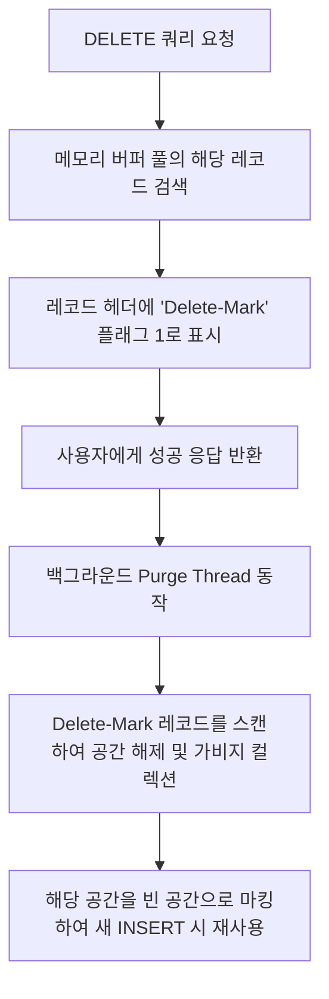

# MySQL DELETE, 소프트 딜리트 & 인조키 완벽 가이드

> [!NOTE]
> 이 가이드는 [dml03.sql](file:///Users/morgan/Documents/workspace/260714_dml-ddl/dml03.sql)의 하드 딜리트, 소프트 딜리트, 그리고 인조키와 관련된 흐름을 바탕으로 작성되었습니다. 데이터 삭제 전략의 물리적 차이와 인조키/자연키 설계 방안을 상세히 학습할 수 있도록 구성했습니다.

---

## 1. DML: DELETE & 소프트 딜리트 개요 (SQLD 핵심)

데이터베이스에서 불필요한 데이터를 제거하는 방식은 크게 물리적으로 삭제하는 **하드 딜리트(Hard Delete)**와 논리적 플래그를 활용해 남겨두는 **소프트 딜리트(Soft Delete)**로 나뉩니다. 또한, 이 과정에서 레코드를 고유하게 식별하기 위한 **기본키(PK) 설계 방식(자연키 vs 인조키)**이 밀접하게 연관됩니다.

### 삭제 유형 및 키 설계 정의

* **하드 딜리트 (Hard Delete / 물리 삭제)**: `DELETE` 명령어를 사용해 테이블에서 데이터를 실제 물리적으로 삭제하는 전통적인 DML 방식입니다.
* **소프트 딜리트 (Soft Delete / 논리 삭제)**: 실제 행을 지우지 않고 `is_deleted`나 `deleted_at` 같은 컬럼을 두어 삭제 여부 상태만 `UPDATE` 하는 방식입니다.
* **자연키 (Natural Key)**: 주민등록번호, 이메일, 전화번호와 같이 비즈니스적 의미를 지니면서 중복되지 않는 고유한 속성을 PK로 삼는 방식입니다.
* **인조키 (Surrogate Key / 대체키)**: 일련번호(`AUTO_INCREMENT`), UUID와 같이 비즈니스적 의미가 전혀 없고 오직 식별을 위해 시스템이 생성해 주는 임의의 키를 PK로 삼는 방식입니다.

---

## 2. 초심자를 위한 쉬운 비유

### (1) 하드 딜리트 vs 소프트 딜리트
* **하드 딜리트 (물리 삭제)**: 중요 서류를 **"문서 파쇄기"**에 넣어 완전히 갈아버리는 것입니다. 파쇄된 서류는 다시 복구할 수 없으며 흔적도 남지 않습니다.
* **소프트 딜리트 (논리 삭제)**: 서류에 빨간펜으로 **"취소선(is_deleted = 1)"**을 긋고 캐비닛 구석에 보관하는 것입니다. 눈앞의 활성 서류철(is_deleted = 0)에서는 빠지지만, 나중에 필요할 때 취소선만 지우면 즉시 원래대로 살릴 수 있습니다.

### (2) 자연키 vs 인조키
* **자연키 (Natural Key)**: 태어날 때 얻는 **"지문 정보"**나 **"주민등록번호"**를 회원 관리 키로 삼는 것입니다. 확실하게 고유하지만 개명하거나 번호 체계가 바뀌면 서류 전체를 뜯어고쳐야 합니다.
* **인조키 (Surrogate Key)**: 놀이공원 매표소에서 나눠주는 **"입장 대기 번호표(1번, 2번 ...)"**입니다. 대기표 번호는 내 이름이나 나이와 아무 관계가 없지만, 번호표 순서대로 편리하게 사람을 구별하고 관리할 수 있게 해줍니다.

---

## 3. SQL DML 문법 및 일반화 예시

### (1) 하드 딜리트 (Hard Delete)
* 데이터를 복구할 필요가 없거나 개인정보 처리방침에 의해 영구 삭제해야 할 때 사용합니다.
* 관련 예시 코드: [dml03.sql:L2-L6](file:///Users/morgan/Documents/workspace/260714_dml-ddl/dml03.sql#L2-L6)

```sql
-- 트랜잭션 내에서 안전하게 삭제 진행
START TRANSACTION;

DELETE FROM target_table
WHERE pk_column = 3;

COMMIT;
```

### (2) 소프트 딜리트 (Soft Delete)
* 데이터 복구 가능성을 열어두고 서비스 이력 관리가 필요할 때 상태값을 변경하는 방식입니다.
* 관련 예시 코드: [dml03.sql:L9-L14](file:///Users/morgan/Documents/workspace/260714_dml-ddl/dml03.sql#L9-L14)

```sql
-- 상태를 '삭제됨(1)'으로 변경 (실제 DELETE가 아닌 UPDATE 사용)
UPDATE target_table
SET is_deleted = 1
WHERE pk_column = 1;
```

### (3) 소프트 딜리트 데이터 조회 필터링
* 소프트 딜리트를 적용한 경우, 모든 서비스 조회 쿼리(SELECT)에 조건 필터링이 수반되어야 합니다.
* 관련 예시 코드: [dml03.sql:L15-L21](file:///Users/morgan/Documents/workspace/260714_dml-ddl/dml03.sql#L15-L21)

```sql
-- [1] 정상 노출할 활성 데이터만 조회
SELECT * 
FROM target_table 
WHERE is_deleted = 0;

-- [2] 삭제 이력 데이터/휴지통 데이터 조회
SELECT * 
FROM target_table 
WHERE is_deleted = 1;
```

---

## 4. 주니어를 위한 원리 및 구조 설명 (Deep Dive)

### (1) InnoDB 하드 딜리트(DELETE)의 물리적 동작 원리
사용자가 `DELETE FROM`을 실행하면 MySQL 엔진은 디스크에서 데이터를 즉시 지우지 않습니다.



* **삭제 마킹 (Delete-marking)**: 행 헤더의 플래그 필드를 수정하여 삭제되었다고 마킹만 해두고 넘어갑니다. 이는 동시성 트랜잭션의 MVCC를 유지하기 위함입니다.
* **공간 파편화 (Fragmentation)**: Purge Thread에 의해 디스크 공간이 비워져도, 운영체제(OS) 수준에서 파일 용량이 줄어들지 않고 테이블 내부에 **구멍(Free Space)**으로 남습니다. 이 구멍들이 불규칙하게 많아지면 조회 성능이 저하(파편화)됩니다.

### (2) 소프트 딜리트와 UNIQUE 제약조건 충돌 문제
* **한계**: 이메일(`email`) 컬럼에 `UNIQUE` 제약조건이 걸려있을 때, 기존 회원이 탈퇴(소프트 딜리트, `is_deleted = 1`)한 상태에서 신규 회원이 동일한 이메일로 가입을 시도하면 기존의 삭제된 행 때문에 **UNIQUE 중복 에러**가 발생합니다.
* **해결 방안 (복합 UNIQUE 사용)**:
  삭제 일시(`deleted_at`) 컬럼을 두고, `(email, deleted_at)` 복합 UNIQUE 인덱스를 구성합니다. 삭제되지 않은 레코드의 `deleted_at`은 `NULL` 또는 특정 기본값(예: `1970-01-01 00:00:00`)으로 세팅해 관리합니다.

### (3) 인조키(Surrogate Key) 사용의 당위성
* **자연키의 취약성**: 주민등록번호나 이메일 같은 자연키는 법률 제정(주민번호 수집 금지 등)이나 비즈니스 요구사항(이메일 ID 변경 허용)에 의해 물리적 구조 및 매핑 값이 깨지기 쉽습니다.
* **조인(Join) 성능**: 문자열로 된 자연키를 참조키(FK)로 전파해 사용하면 인덱스 크기가 커지고 비교 연산 성능이 떨어집니다. 반면 인조키는 고정 크기 정수(`BIGINT`)나 정렬 가능한 순차적 ID를 가지므로 조인 및 인덱스 검색 성능이 뛰어납니다.

---

## 5. SQLD 자격증 준비 대비 요약 가이드

### ① 삭제 명령어 3형제 비교 (자격검정 필수 암기)
SQLD 시험에서 `DELETE`, `TRUNCATE`, `DROP`을 구분하는 문제는 매회 출제됩니다.

| 비교 항목 | `DELETE` | `TRUNCATE` | `DROP` |
| :--- | :--- | :--- | :--- |
| **SQL 분류** | DML (Data Manipulation) | DDL (Data Definition) | DDL (Data Definition) |
| **삭제 대상** | 데이터(행 단위) | 데이터(테이블 전체) | 테이블 구조 전체 + 데이터 |
| **디스크 용량** | 유지됨 (HWM 감소 안 함) | 초기화됨 (HWM 감소함) | 파일 전체 삭제 |
| **롤백 가능 여부** | **가능** (Undo 로그 생성) | **불가능** (Auto-Commit) | **불가능** (Auto-Commit) |
| **삭제 속도** | 느림 (Row-by-Row로 하나씩 삭제) | 매우 빠름 (공간 재할당) | 매우 빠름 |

---

## 6. 기술 면접 예상 질문 & 모범 답안

### Q1. 하드 딜리트(Hard Delete)와 소프트 딜리트(Soft Delete)의 실무적 장단점과 선택 기준을 설명해주세요.
> **모범 답안:**
> * **하드 딜리트**:
>   * *장점*: 실제 디스크 공간을 확보할 수 있고 비워진 파일 관리가 깔끔하며, `SELECT` 시 추가적인 플래그 조건(`WHERE is_deleted = 0`)이 필요 없어 쿼리가 단순하고 인덱스 설계가 쉽습니다.
>   * *단점*: 실수로 지웠을 때 백업 데이터가 없다면 복구가 어렵고, 로그 분석이나 사용자 행동 추적용 데이터를 상실합니다.
> * **소프트 딜리트**:
>   * *장점*: `UPDATE` 한 번으로 데이터를 안전하게 임시 보관하므로 쉽게 복구할 수 있으며 데이터 분석 및 탈퇴 회원 사후 관리용으로 유리합니다.
>   * *단점*: 디스크 용량이 계속 누적되며, 모든 조회 쿼리마다 삭제 조건을 동반해야 해서 인덱스 전략이 복잡해지고 실수로 조건 누락 시 삭제된 데이터가 화면에 노출되는 버그를 초래할 수 있습니다.
> * *선택 기준*: 회원 탈퇴, 게시글 삭제처럼 복구 필요성이 빈번하고 분석 가치가 높은 데이터는 **소프트 딜리트**를 채택하고, 일시적 로그 적재 데이터나 개인정보 보호법상 파기가 의무인 데이터는 **하드 딜리트**를 사용합니다.

### Q2. 대량의 데이터를 `DELETE`한 후에 DB 용량이 줄어들지 않고 오히려 성능이 저하되는 원인과 이를 해결하기 위한 MySQL 명령어를 설명해주세요.
> **모범 답안:**
> * **원인**: MySQL(InnoDB)에서 `DELETE`를 하면 데이터가 실제 지워지는 대신 가용 가능한 '빈 구역(Delete-mark)'으로 플래그만 설정됩니다. 이로 인해 물리 디스크 크기는 줄어들지 않고 테이블 내부에 구멍이 숭숭 뚫리는 **테이블 파편화(Fragmentation)** 현상이 생기며, Range Scan 시 불필요한 빈 페이지를 많이 읽게 되어 성능이 떨어집니다.
> * **해결책**: 해당 테이블에 대해 `OPTIMIZE TABLE 테이블명;` 명령을 수행합니다. 이 명령은 새로운 물리 영역에 테이블 데이터를 파편화 없이 다시 정렬해 쓰고 기존 영역을 운영체제에 반환하여 실제 용량을 축소하고 탐색 속도를 복원해 줍니다.

### Q3. 기본키(PK) 설계 시 이메일이나 주민번호 같은 자연키(Natural Key) 대신 자동 증가 정수 같은 인조키(Surrogate Key)를 지향해야 하는 핵심 이유를 조인(Join)과 비즈니스 관점에서 설명해 주세요.
> **모범 답안:**
> * **비즈니스 관점**: 이메일이나 주민번호 같은 자연키는 실세계 정책(회원의 이메일 수정 권한 허용, 법률적 개인정보 수집 차단 등) 변화에 맞춰 변할 가능성이 존재합니다. PK 값이 변경되면 해당 키를 외래키(FK)로 물고 있는 하위 테이블들의 관계 데이터까지 전부 업데이트해야 하므로 정합성 유지에 부담이 큽니다. 반면 인조키는 비즈니스와 무관해 일관되게 유지됩니다.
> * **조인 및 성능 관점**: 인조키는 보통 4바이트 또는 8바이트 정수형(`INT`, `BIGINT`)을 사용하므로, 문자열로 된 자연키에 비해 인덱스 크기가 훨씬 작아 메모리(Buffer Pool) 효율이 높고, CPU의 정수 비교 연산 속도가 문자열 연산보다 훨씬 빨라 다중 테이블 조인 시 쿼리 성능이 대폭 향상됩니다.
